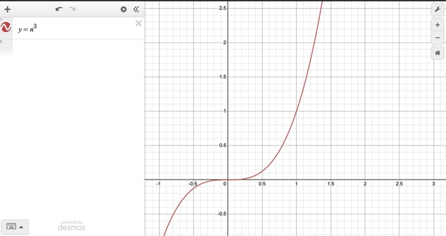

# Template 1


## Index.html
The cover page uses two SVG's one is the "colored-in" text, and the 
other is the fill. Together a see through effect occurs when an image overlays
above both SVGs.

About the image transformation:
The images y-axis is being transformed according to the y-distanced pixels scrolled
plus the window's inner height divided by two which results in the middle of the view port.
The middle of the view port is useful because with that value we can obtain the middle 
of each image and calculate the y-direction transformation.

To further smoothen the vertical transformation I created a cubic function
which is represented as `n^3` and takes the middle view port value as a parameter.



**Figure 1: the rate of change of n^3 is a quadratic equation**

### Menu Behavior


On hovering links:
The image container is positioned `relative`, and the children images
are positioned `absolute`. This allows for stacking to occur so when
each link is hovered the respective background image is revealed with JavaScript and `ZIndex` order.
In future projects, I achieve this same effect with CSS only!

On opening the menu: 
a `setTimeOut()` is launched. I use a setTimeOut function because I can access 
each link's index and create a top to bottom staggering opacity animation. Intriguing enough,
a bottom to top staggering animation can be achieved by using `column-reverse` with `flexbox` on the links container.

On closing the menu:
each active class is removed with a timer as well to create a "stagger out" effect for each link. It is imperative to 
remove the active class so the staggering effect can work when the menu is opened and closed.

## Contact.html
This page has the on scroll image opacity effect. 
The main div has a minumum height of `4000px` so there is a greater scrolling range. If there isn't enough scroll space 
then each image does not have the potential to stick! So, `4000px` height is an arbitrary choice.

Moreover, each image, and not the container itself have position `sticky` applied. That is because there is only one container, but 
multiple images so with JavaScript I use `getBoundingClientRect()` to detect if each image is in view - if so remove opacity, vice-versa.
The effect must be applied to each image for this to work.

```
const images = document.querySelectorAll("div.img-container img");

const fadeIn = function () {
    images.forEach((image) => {
        const imageTop = image.getBoundingClientRect().top;
        const imageBottom = image.getBoundingClientRect().bottom;

        if (imageTop === 0 && imageBottom > 0) {
            image.classList.add("active");
        } else {
            image.classList.remove("active");
        }
    });
};

document.addEventListener("scroll", function () {
    fadeIn();
});
```
This is the calculation done to detect if each image is in view. By default
the images just layer and stick ontop of eachother if no JavaScript is used! Which creates
a variation stacking effect. Another option to detect if images are in view is to use
`InteresectionObserver`
